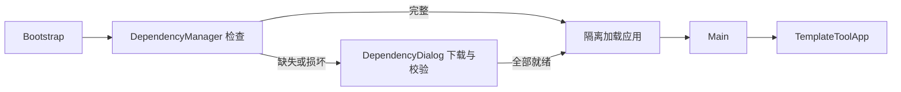
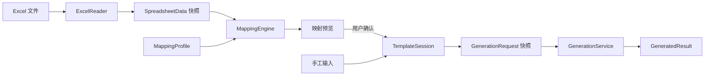

# 项目结构与开发说明

本文面向维护与扩展开发，说明当前模块职责、数据流和接口约束。程序介绍、操作步骤、构建命令及项目目录概览见 [README](README.md)。

项目本体由主源码、测试源码、资源、构建/启动脚本、依赖锁定清单和文档组成。目录概览只列这些维护对象；依赖缓存、编译产物、用户模板、运行配置和本地编辑器文件不列入源码结构。

## 模块职责

主源码位于 `src/main/java/com/firefly/`。

| 模块或入口 | 主要职责 | 关键类 |
| --- | --- | --- |
| `bootstrap` | 检查运行依赖、下载校验、显示进度，就绪后加载应用 | `Bootstrap`、`DependencyManager`、`DependencyDialog` |
| 应用入口与主窗口 | 初始化外观、组装选项卡、协调模板操作与生成/导出 | `Main`、`TemplateToolApp`、`TemplateConstants` |
| `application` | 当前模板会话、变量校验、生成快照和结果生命周期 | `TemplateSession`、`VariableValidation`、`GenerationRequest`、`GenerationService`、`GeneratedResult` |
| `core` | 模板与表达式解析、数值/日期相关格式、Word 处理、配置读写及兼容迁移 | `TemplateParser`、`TemplateRenderer`、`ExpressionEvaluator`、`DocxProcessor`、`TemplateConfigStore`、`AppConfigStore` |
| `extraction` | Excel 快照读取、映射规则和结构匹配 | `ExcelReader`、`SpreadsheetData`、`MappingProfile`、`MappingEngine` |
| `ui` | Swing 控件、数据提取页、输入反馈、帮助与后台任务交互 | `DataExtractionPanel`、`VariableInputPanel`、`DatePickerPanel`、`ResultPanel`、`FileTaskManager`、`TemplateHelpDialog`、`AboutDialog` |

`application` 不依赖 Swing。`extraction` 的读取器使用 POI，映射模型与匹配结果不持有 POI 工作簿。`core` 的模板配置引用纯数据的映射模型，不依赖 Excel 读取实现或界面。

## 启动链路



- JAR 入口是 `bootstrap.Bootstrap`。准备层仅使用 JDK 和现有 `JsonData`，校验完成前不得引用主界面或 POI 类。
- 运行时以 JAR 内置的 `dependencies.lock.json` 为准。本地缓存完整时只读检查，不联网、不写下载锁。
- 下载限定 Maven Central HTTPS，校验 SHA-256 后才发布正式文件。失败或取消清理本次临时下载；已完成依赖保留。连接和读取均有超时。
- 多个运行实例通过依赖缓存中的文件锁协调下载；锁文件保留以避免删除后重新创建引起竞争。等待下载锁时可以取消。
- 就绪后建立新的 `URLClassLoader`，仅包含应用 JAR 与锁定依赖，避免启动阶段缺失文件的类加载缓存影响后续运行。设置上下文类加载器后调用 `Main`。
- 右上角“关于”通过 `AboutDialog` 从 JAR 读取本项目 LICENSE、纯文本第三方说明及完整许可原文；`TemplateHelpDialog` 只负责模板操作帮助。发布包的入口、依赖清单和说明资源由主构建统一打包。

## 模板、数据与结果流



“模板填充”和“数据提取”共享一个 `TemplateSession`。恢复映射、切换工作表或选定行列、刷新 Excel 都只更新预览；显式应用才修改变量。生成操作及其快捷键只在“模板填充”页生效。

主窗口订阅会话变化，负责刷新控件、保存设置及废弃旧结果。生成器使用独立的输入快照，完成时通过版本检查判断结果是否仍对应当前输入。生成器不读取 Swing 控件，也不读取 Excel。

## 会话更新接口

| 接口 | 约定 |
| --- | --- |
| `setValue` / `activateType` | 更新手工输入或当前类型，保留已有类型草稿行为 |
| `applyValues` | 按当前类型校验整批数据，失败时不修改变量，成功后统一通知 |
| `applyImportedValues(values, locations)` | 一次提交变量值、来源和最近一次导入的撤销记录 |
| `sourceDescription` | 提供导入来源及是否发生后续手工修改的信息 |
| `undoImport` | 恢复仍符合导入值、类型和锁定条件的变量，保留冲突项并返回其名称 |
| `variables` / `variable` | 返回快照或副本，调用者不能绕过会话直接修改内部状态 |

会话操作在 Swing 事件线程串行执行。后台任务只处理文件或独立快照，结果回到事件线程后再提交。成功加载或新建模板会清空导入来源和撤销记录；只保存最近一次导入的撤销信息。

## Excel 读取与映射约束

`ExcelReader` 只读加载 `.xlsx`，提取显示值、底层值、公式缓存结果和合并区域，结束后关闭工作簿。缺少公式结果或公式错误会作为问题返回，不回填公式文本，也不在程序中重算。

当前读取上限为 128 MB 文件和 30 万个已定义单元格，超限拒绝，不截断。每条映射取一个单元格；当前不实现区域聚合、多表关联、多层表头自动推断或批量生成。

`MappingProfile.Binding` 保存目标变量、来源工作表提示、定位方式、0 起始坐标、创建时读取到的行标题和列标题、标题上下文、空值策略和选定范围。`MappingProfile.SheetSettings` 只保存横向与纵向标题骨架、标题行和标题列。`WorksheetStructureMatcher` 用标题骨架识别逻辑工作表并计算整体移动量；名称相同且结构相符时优先，否则只接受唯一结构匹配。`SelectionScope.GLOBAL` 使用当前工作簿中按实际工作表维护的运行时取值行列，`LOCAL` 将绑定自身的 `row` 或 `column` 按结构移动量换算。界面当前工作表只影响查看和编辑，不参与已保存映射的来源选择。

| 定位方式 | 匹配规则 |
| --- | --- |
| `FIXED` | 使用坐标，并检查已保存的结构锚点；无锚点时要求在本次文件上显式绑定 |
| `TITLES` | 查找包含表头上下文的标题行，再唯一定位目标列和行标题；允许行列移动 |
| `RECORD` | 锁定列／更改选定行：在映射来源工作表按列标题匹配，读取该表的全局行或映射自己的行 |
| `COLUMN_RECORD` | 锁定行／更改选定列：在映射来源工作表按行标题匹配，读取该表的全局列或映射自己的列；不要求每个数据列有表头 |

`Binding.headers` 在 `COLUMN_RECORD` 中保存行标题列的纵向标题列表，在其他模式中保存表头行的横向标题列表。行、列选择分别传入解析器，互不覆盖。列选择必须位于匹配到的行标题列右侧；合并标题跨多行或标题重复时拒绝定位。

`DataExtractionPanel` 在后台同时生成已保存映射的整批预览和当前编辑映射的单条预览。`Match` 带有实际行标题和列标题；表格来源及下方说明统一显示工作表、地址、两种标题、模板、变量、原值和填入值。有未保存的映射编辑时禁止应用旧映射。空值或格式错误也保留已定位的来源，避免说明退回旧坐标。

`SpreadsheetPreview` 将原始数据表、冻结的行号/行标题表以及列号/列标题区分开，滚动位置由 `JScrollPane` 同步。数据表使用单行、单列选择模型，只高亮交叉处的一个数据格；行列标题不跟随高亮，点击标题只更新记录选择。数据表坐标直接对应 Excel 的 0 起始行列。数据表唯一管理共享列宽，避免标题行布局改变数据区的列宽。变量表是唯一变量选择入口，预览刷新后保留所选行，并显示定位方式、范围及带标题的实际来源。

同名工作表只有在标题骨架仍匹配时才优先使用；否则查找其他结构相同的工作表。标题骨架最多保存横向、纵向各 32 个非空锚点，忽略数据值和 Excel 外观样式。多个候选、必要标题缺失或合并标题造成歧义时不猜测。未映射的变量保留手工输入；已删除变量的映射保留但不执行，直到用户清理。

文本导入使用显示值，数值导入使用底层数值。空值仅有 `KEEP`（默认保留原值，文本额外显示提示）和 `ZERO`（数值填入 0，文本报错）两种策略；错误、缺失标题及越界来源不会转成 0。应用前验证整批数据，避免部分变量先被覆盖。

应用当前变量只验证当前选中的已保存映射，并通过同一个 `applyImportedValues` 事务写入单项；应用全部变量验证整批，任一错误均阻止整批写入。两种应用都检查源文件变化、未保存草稿和变量预览版本。

## 配置与持久化

| 配置 | 保存内容 |
| --- | --- |
| 应用配置 | 上次模板、界面布局与字号、Excel 选取目录和结果导出目录 |
| 模板配置 | 模板相对路径、当前变量类型和值、小数位数、可选 Excel 映射 |

窗口每次使用受屏幕可用范围限制的 1440×1000 默认尺寸，不保存尺寸。`layout.extractionDividerLocation` 保存数据提取上下分隔位置；布局时根据变量表最小可用高度进行显示范围限制，但不覆盖保存的位置。

模板配置通过模板完整相对路径关联。当前配置格式版本为 4，映射子格式版本为 7；版本 7 不再持久化全局取值行列，只保留逐工作表的标题结构。旧配置保持可读，其中 `recordRow`、`recordColumn` 会被忽略。旧 `RECORD` 身份不变，旧 `ERROR`、`CLEAR` 空值策略读取为 `KEEP`，缺少 `selectionScope` 时读取为 `GLOBAL`。`TemplateConfigStore.migrateLegacyMappingStates` 仍负责移除旧启用状态字段。配置模型示例：

```json
{
  "version": 4,
  "template": "报告/月报.docx",
  "decimalPlaces": 2,
  "variables": {},
  "dataExtraction": {
    "version": 7,
    "bindings": [],
    "sheets": [
      {
        "sheet": "客户表", "headerRow": 0, "titleColumn": 0,
        "columnHeaders": ["姓名", "电话"], "rowTitles": ["姓名", "张三", "李四"]
      }
    ]
  }
}
```

`TemplateConfigStore.saveMapping` 重新读取当前配置后只修改映射；变量保存也保留已有映射。清理未使用变量只影响变量部分；程序内重命名会移动整份配置并更新模板路径。写入统一使用 `AtomicConfigWriter`。

有效映射编辑后立即保存。保存失败保留内存编辑并显示未保存状态，切换或关闭前再次尝试保存。文件选择和导出位置只在操作成功后更新。兼容迁移保留旧存档，不把迁移备份当作当前配置继续写入。

## 后台任务与错误恢复

`FileTaskManager` 管理文件任务的阶段、进度与取消。模板加载失败或取消保留原会话。数据提取页的加载与映射检查各有递增序号，只有最新任务可以安装结果，避免较早请求覆盖新预览。

工作簿在外部改变修改时间或大小后，应用旧预览会被阻止并要求刷新。生成结果保留创建时的模板与输入版本，输入变化后由主窗口禁止误用旧结果。

## 构建与测试职责

- `build.bat`：准备锁定依赖，递归编译主源码；打包应用类、内置依赖清单、本项目许可证、第三方说明及 `src/main/resources/` 下的许可资源；打包前核对许可汇总与锁定依赖及原始 LICENSE/NOTICE 一致。先完成临时 JAR，再替换正式 JAR。
- `build-test.bat`：准备依赖，针对现有应用 JAR 编译并运行 `AllTests`，不重建或改写主程序。
- 两个脚本各自内嵌依赖准备和清理逻辑，不需要额外辅助脚本。各自清理编译与测试中间文件，保留运行依赖和用户数据；测试样例通过独立临时目录统一回收。
- 构建时以仓库中的 `dependencies.lock.json` 为准；运行时以打入 JAR 的副本为准。更新依赖后需要重新构建发布包。

测试源码位于 `test/java/com/firefly/`：

| 套件 | 覆盖范围 |
| --- | --- |
| `TemplateFeatureTests` | 模板语法、表达式、格式、Word、配置及迁移 |
| `application/ApplicationTests` | 会话、批量赋值、生成快照、清理及界面接线 |
| `extraction/ExtractionTests` | 真实 xlsx、映射重定位、配置合并、导入撤销及双选项卡联动 |
| `bootstrap/BootstrapTests` | 离线缓存、下载校验、失败/取消清理、重试、并发启动和类加载 |

`AllTests` 是套件统一入口。依赖完整后，回归中的下载场景使用替代下载源，不依赖外网。修改主源码后先构建主程序，再运行测试。

## 扩展时遵守的边界

新增数据源应输出独立数据快照和映射预览，经 `TemplateSession` 统一应用；不直接修改输入框、持久化配置或生成器。新增生成能力通过 `GenerationRequest` / `GenerationService` 接入，保留输入快照与结果版本检查。新增后台操作复用现有任务管理和取消流程。

新增源码包由构建脚本递归发现；新增测试套件在 `AllTests` 中注册。更新依赖时同步锁定清单和第三方说明，确保启动准备层仍能在没有第三方库的情况下运行。

许可原文维护在 `src/main/resources/META-INF/THIRD_PARTY_LICENSES.txt`，属于需提交仓库的项目资源，不是运行缓存。上游未在二进制中附带的许可由对应版本源码或标签补齐；具体来源和分发要求见 [第三方依赖说明](THIRD_PARTY_NOTICES.md)。
