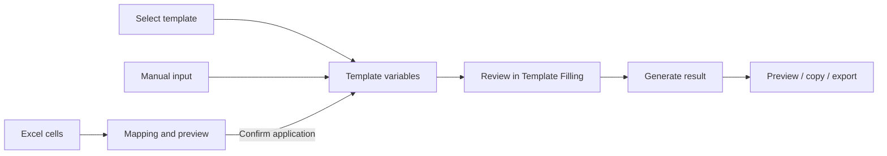

# Template Filler Tool

[中文](README.md) · [Architecture and Development](PROJECT_STRUCTURE.md) · [Third-Party Notices](THIRD_PARTY_NOTICES.md)

## Overview

A Java Swing desktop application that fills text and Word templates with manually entered values or Excel data. It is intended for recurring documents such as notices, quotations, and reports with a fixed format.

| Capability | Description |
| --- | --- |
| Template filling | Supports `.txt` and `.docx`; enter each named variable once |
| Variables and calculations | Numbers, short text, multiline text, arithmetic expressions, automatic numeric variables, and built-in dates |
| Excel extraction | Preview `.xlsx` cells and map their values to template variables |
| Reusable mappings | Match headers and row titles instead of binding rules to a workbook filename |
| Output | Preview, copy text, or export files; Word output preserves template formatting |
| Local persistence | Remember variable settings, mappings, layout, and previous open/export locations |

Both tabs share the current template and variables. **Data Extraction only previews, maps, and applies values. Document generation takes place in Template Filling.** The application currently uses Chinese interface labels.

## Quick Start

### Requirements and launch

- Runtime: Windows with Java 17 or later, including desktop graphics support. A full JDK 17 or later also works.
- Building from source: a full JDK 17 or later and Windows PowerShell. Maven and Gradle are not required.
- Use a writable application directory for templates, configuration, and dependency downloads. Missing dependencies require access to Maven Central.

If you already have `TemplateTool.jar`, double-click the adjacent `launcher.bat`, or run:

```bat
java -jar TemplateTool.jar
```

If you only have source code, build the JAR using the instructions below.

### First document

1. In Template Filling (`模板填充`), select a template or use New Template (`新建模板`) to create a text template.
2. Add placeholders such as `{{客户}}` and `{{数量}}`, then save the template.
3. Choose variable types, enter values, and check the base date and decimal places.
4. Select Generate Result (`生成结果`), review the preview, then copy or save the result.

For example:

```text
Customer: {{客户}}
Date: {{今日年月日}}
Quantity: {{数量}}, unit price: {{单价}}
Amount: {{=数量*单价}}
Notes: {{备注}}
```

Set `客户` to short text and `备注` to multiline text. `数量` and `单价` are locked to numeric because the expression uses them. To populate values from Excel, follow the extraction workflow below.

## How It Works

### Startup and dependencies

1. The JAR entry point reads its embedded dependency lock and verifies the adjacent `lib/` files with SHA-256.
2. A complete local cache opens the application offline. Missing or corrupted files trigger a preparation dialog with file progress and an overall completion count.
3. The main window opens only after every dependency passes verification. Failed downloads can be retried or cancelled; completed downloads are retained and partial files are cleaned.

Both building and running use `lib/`, but it does not need to be prepared manually. Running the JAR does not require an external copy of the dependency lock.

### From data to output



Opening another workbook or restoring mappings updates the preview only. Click Apply to Template Variables (`应用到模板变量`) to change values. Editing the template, variables, or date invalidates existing results; generate again before using the new output.

Loading, saving, generating, and exporting run as background file tasks. Cancellable tasks expose a cancel control. Switching or refreshing templates handles unsaved edits first; a failed or cancelled load preserves the previous template.

## Usage

### Fill and export a template

- **Select:** use `选择模板文件…` to open `.txt` or `.docx`. Templates live under `Templates/` and may be organized in subfolders.
- **Edit:** text templates can be edited and saved in the application. Word templates are read-only; edit them externally, then use Refresh Template (`刷新模板`). New Template creates `.txt` files.
- **Enter values:** each variable appears once. Use Expand (`展开…`) for multiline text. Variables used in expressions cannot be changed to text types.
- **Date and precision:** each launch starts with today's date. Enter `yyyy-MM-dd` or use the calendar. Numeric output uses 0–10 decimal places, defaulting to 2.
- **Generate and export:** generate only in Template Filling. Export the generated `.docx` to preserve Word formatting; copying provides text content.

### Extract Excel data

1. Select the target template and variable types. Names, identifiers, and dates usually use text; calculation inputs use numeric types.
2. Open Data Extraction (`数据提取`) and choose an Excel file (`选择 Excel…`). The top flow shows `workbook.xlsx → template.txt/.docx`; template selection is synchronized with Template Filling.
3. Select a worksheet, Column Titles Row (`列标题所在行`), and Row Titles Column (`行标题所在列`, accepting letters or column numbers). Column letters and titles appear on separate rows at the top; row numbers and titles appear in separate columns on the left. These header areas stay visible while scrolling; hover to read long titles.
4. Click a variable in the lower table; Current Variable (`当前变量`) displays its name and type. Select the source cell and positioning mode, then select `添加／更新映射`. Each variable has one mapping; one source may populate several variables.
5. Compare displayed content, the value to import, the existing value, and status. Resolve issues and select `应用到模板变量`.
6. Return to Template Filling to review, adjust, generate, and export.

| Positioning mode | Suitable data | Reuse behavior |
| --- | --- | --- |
| Fixed cell | Reports with a stable layout | Uses coordinates with structural checks; layout changes require rebinding |
| Row/column titles | Similar reports whose rows or columns may move | Relocates by titles and context, including renamed workbooks and worksheets |
| Lock column / change selected row (`锁定列／更改选定行`) | One customer, project, or record per row | Finds the column by title and reads the selected row |
| Lock row / change selected column (`锁定行／更改选定列`) | One customer, project, or record per column | Finds the row by title and reads the selected column |

The row and column selectors retain their values separately and only affect their corresponding mode. The selector is hidden for fixed-cell and row/column-title mappings. The explanation below the mapping table shows the resolved source, destination template and variable, existing value, and expected replacement. Unsaved mapping edits must be added/updated before application. Selecting a different row or column only updates the preview.

Same-name suggestions (`同名绑定建议…`) propose uniquely matching columns, or matching rows in locked-row mode, for user confirmation. Existing mappings can be updated or changed to manual entry. Unmapped variables also remain in the selection table. Use `清理失效映射` to remove mappings for variables no longer present in the template.

Each launch uses a 1440×1000 default window, limited to the available screen area; window size is not remembered. The extraction divider position is saved and clamped to keep the lower variable table visible on smaller windows.

### Excel values and mapping limits

- **Formulas:** reads saved calculation results, never formula text. It does not recalculate or modify the workbook. Recalculate and save in Excel, then refresh if results are missing or erroneous; saved results can also be stale.
- **Text and numbers:** text uses displayed content, retaining leading zeros, date formats, and line breaks. Numbers use underlying values rather than rounded display values. Dates cannot be imported as numeric serials.
- **Empty values:** an empty source cell defaults to Keep Existing Value (`空值保留原值`); Use Zero (`空值取0`) is also available. Numeric targets can retain their value or receive zero. Text targets show a notice when keeping existing text; Use Zero reports an error and blocks application. A literal zero is valid data. Missing titles, erroneous cells, and ambiguous sources are errors, never ordinary blanks.
- **Legacy mappings:** the original record mode keeps its bindings under the new label. Legacy ERROR and CLEAR empty policies load as Keep Existing Value; each mapping can be changed to Use Zero explicitly.
- **Legacy enabled state:** startup rewrites old configuration files, removes enabled flags, and converts disabled mappings to manual entry without changing variable values. Loading an imported legacy configuration also performs this conversion. Runtime mappings no longer have an enabled/disabled state.
- **Structural changes:** mappings are restored only when sources can be uniquely located. Missing or duplicate required titles need rebinding. Fixed coordinates without recognizable anchors require explicit binding after opening the file.
- **Saving and undo:** valid mapping changes are saved with the template, without binding to an Excel filename. Undo Last Import (`撤销本次填入`) preserves conflicting later manual edits. Source indicators (`↗`) and undo history last only for the current template session.
- **External changes:** refresh if the workbook changes or becomes inaccessible. Refreshing does not itself replace entered values.

The current scope is `.xlsx`, a single configured header row, and merged-title display. Each mapping reads one cell. Legacy `.xls`, automatic multilevel-header inference, range aggregation, joins across sheets, and batch document generation are not supported. Files above 128 MB or 300,000 defined cells are rejected rather than truncated.

## Template Syntax

### Variables and expressions

| Syntax | Meaning |
| --- | --- |
| `{{客户}}` | A variable with a numeric or text type |
| `{{1}}` | A variable named `1` |
| `{{=数量*单价}}` | An arithmetic expression |
| `{{=金额*5%}}` | Percentage calculation; `5%` means `0.05` |
| `{{=[1]*[2]}}` | References variables named `1` and `2`, not numeric constants |
| `{{=[销售 数量]*[单价-折扣]}}` | Brackets reference names containing spaces or special characters |
| `\{{Customer}}` | Escaped placeholder; outputs literal `{{Customer}}` without creating or referencing a variable |

Expressions support `+`, `-`, `*`, `/`, `**` (power), postfix `%`, and parentheses. Numeric constants support scientific notation. `{{=1*2}}` multiplies constants. Built-in date variables cannot participate in arithmetic.

Short-text and multiline-text values may also contain placeholders and can be nested. Child variables are collapsed by default; use the arrow beside a variable to expand them. Names are global, so the same variable shares one type and value at every level. Cycles show their reference path and prevent generation, and nesting is limited to 20 levels. Escaping works in the main template and in every text variable. Backslashes immediately before a placeholder use odd/even pairing: `\{{Customer}}` outputs literal `{{Customer}}`, while `\\{{Customer}}` outputs one backslash followed by the resolved Customer value.

Blank manual numeric input is zero. Numbers and expression results are rounded and padded to the template's decimal precision. Excel empty values follow mapping policies instead of this manual-input rule.

### Automatic numeric variables

`{{上月天数}}`, `{{本月天数}}`, and `{{下月天数}}` output the actual number of days in the previous, base, and next month: `28`, `29`, `30`, or `31`. They have no input fields and can participate directly in expressions, for example `{{=上月天数+本月天数+下月天数}}`.

### Date variables

All dates use the selected base date, rather than reading the system date again during generation. Built-in names remain Chinese, including in English-language templates.

| Common syntax | Output |
| --- | --- |
| `{{今日年月日}}` | Full date, such as `2026年9月3日` |
| `{{今日年月}}`, `{{今日年}}` | Year/month or year |
| `{{今日}}`, `{{昨日}}`, `{{明日}}` | Day of the corresponding date, such as `3日` |
| `{{本月}}`, `{{上月}}`, `{{下月}}` | Corresponding month, such as `9月` |
| `{{本月年月}}` | Corresponding year and month |
| `{{本月月首}}`, `{{本月月末}}` | Month/day of the month's first or last day |
| `{{上月月首}}`, `{{上月月末}}` | Month/day of the previous month's first or last day |
| `{{下月月首}}`, `{{下月月末}}` | Month/day of the next month's first or last day |
| `{{本年}}`, `{{上年}}`, `{{下年}}` | Corresponding year |

Yesterday and tomorrow also support the `年`, `年月`, and `年月日` suffixes. Previous/current/next month support `年` and `年月`. Every month-start and month-end variable outputs `X月X日`; month/year boundaries and leap years are handled automatically. F1 help provides the complete list and additional arithmetic examples.

Legacy `[[variable]]` syntax can be backed up and converted to `{{variable}}` when prompted. Unconverted legacy placeholders are not filled.

## Saved Data and Template Management

These items are created during use and are not project source files to commit:

| Location | Contents |
| --- | --- |
| `Templates/` | User templates and template migration backups |
| `Config/` | Per-template variable types, current values, decimal places, and Excel mappings |
| `config.json` | Last template, interface preferences, Excel-open and result-export directories |
| `lib/` | Downloaded runtime dependency cache |

A template's configuration mirrors its relative path and appends `.json` to the full filename. For example, `Templates/contracts/quote.docx` uses `Config/contracts/quote.docx.json`.

- Clicking the template name in the application renames its configuration as well. When moving, copying, or renaming externally, update the matching configuration yourself; close the application first.
- Back up `Templates/` and `Config/` together to preserve templates and settings. Include `config.json` for interface preferences. The dependency cache is not user data.
- Templates without configuration use defaults. Separate drafts for variable types last only for the current session; the active type and value persist across launches.
- Excel-open and result-export directories are remembered separately after successful operations. Cancelling a file dialog does not change them.
- An existing legacy `last_values.json` is migrated read-only and retained. Routine use does not require editing configuration JSON.

The fixed About (`关于`) button at the top right opens the project license, third-party overview, and full legal texts offline. F1 remains dedicated to template syntax and usage help.

## Shortcuts and Troubleshooting

| Shortcut | Action |
| --- | --- |
| `Tab` | Next variable input |
| `Ctrl+Enter` | Generate, only in Template Filling |
| `Ctrl+S` | Save a text template in Template Filling; save mappings in Data Extraction |
| `F1` / `F4` | Help / cycle through input errors |
| `Ctrl+Plus/Minus` / `Ctrl+0` | Change font size / follow system font size |

| Problem | What to check |
| --- | --- |
| Java missing or unsupported version | Install Java/JDK 17 or later and check `JAVA_HOME` or PATH |
| Dependency download fails | Check network access and directory write permissions, then retry; alternatively copy a complete `lib/` |
| Word template cannot be edited | Edit externally, then refresh the template |
| Copy or export is unavailable | Resolve input errors and regenerate after editing the template, variables, or date |
| Excel mappings cannot be restored | Check worksheet, header row, title uniqueness, and positioning mode; rebind if needed |
| Formula result is wrong or missing | Recalculate and save in Excel, then refresh; the application reads saved results only |
| Settings missing after moving a template | Check the corresponding `Config/` path and select the template again |

## Build, Test, and Distribute

From the project directory, run:

```bat
build.bat
```

After a successful main build, run tests separately when needed:

```bat
build-test.bat
```

| Script | Responsibility |
| --- | --- |
| `build.bat` | Prepare dependencies, recursively compile main sources, and package `TemplateTool.jar`; no tests |
| `build-test.bat` | Prepare dependencies and compile/run all regression suites against the existing JAR; no main rebuild or modification |
| `launcher.bat` | Start the existing JAR with Java; dependency checks happen inside the JAR |

Build scripts prefer `JAVA_HOME`, then JDK installations under `Program Files/Java`, then PATH. Rebuild main sources before testing changes. Both scripts repair missing or corrupted dependencies and clean their own intermediates on success or failure. Forced termination may leave temporary files, which the next corresponding build cleans. Compilation or packaging failure preserves the existing JAR.

Dependency versions and SHA-256 values are pinned in `dependencies.lock.json`, which must be committed. See [Architecture and Development](PROJECT_STRUCTURE.md) for source and test responsibilities.

| Distribution | Include |
| --- | --- |
| Internet available on first launch | `TemplateTool.jar`; optional `launcher.bat` and templates |
| First launch must work offline | The above plus a complete `lib/` |

The JAR contains the dependency lock, project license, third-party notices, and full third-party legal texts. Source code and build scripts are not needed for running it. Include matching `Config/` files when sharing saved values and mappings.

## Project Structure

Only maintained project files and modules are shown. Class responsibilities are documented in [Architecture and Development](PROJECT_STRUCTURE.md).

```text
.
├── src/main/java/com/firefly/
│   ├── Main.java                  # Application entry after dependency preparation
│   ├── TemplateToolApp.java       # Main window and workflow coordination
│   ├── TemplateConstants.java     # Placeholder and date constants
│   ├── bootstrap/                # Startup checks, downloads, and progress dialog
│   ├── application/              # Sessions, validation, and result generation
│   ├── core/                     # Parsing, formatting, Word handling, and storage
│   ├── extraction/               # Excel reading, mappings, and structure matching
│   └── ui/                       # Swing tabs, controls, and background task interaction
├── src/main/resources/META-INF/  # Legal resources packaged with the application
│   └── THIRD_PARTY_LICENSES.txt  # Full third-party licenses and attributions
├── test/java/com/firefly/
│   ├── AllTests.java              # Entry for all regression suites
│   ├── TemplateFeatureTests.java  # Syntax, Word, configuration, and migration
│   ├── application/              # Session, generation, and UI wiring tests
│   ├── bootstrap/                # Dependency, offline startup, and launch-gate tests
│   └── extraction/               # Excel reading, mapping, and application tests
├── build.bat                     # Main build
├── build-test.bat                # Test compilation and execution
├── launcher.bat                  # Windows launcher
├── dependencies.lock.json        # Pinned versions, download URLs, and hashes
├── .gitignore                    # Local data and build output exclusions
├── .gitattributes                # Text and batch line-ending rules
├── README.md                     # Chinese user guide
├── README.en.md                  # English user guide
├── PROJECT_STRUCTURE.md          # Module boundaries and development guide
├── THIRD_PARTY_NOTICES.md         # Third-party components and licensing
└── LICENSE                       # Project license
```

## License

This project uses the [MIT License](LICENSE). Dependencies follow their own licenses. Automatic downloads do not remove applicable obligations; retain license and NOTICE files in dependency JARs. See [Third-Party Notices](THIRD_PARTY_NOTICES.md), available offline from About (`关于`) at the top right, together with the project MIT license and full third-party legal texts.
