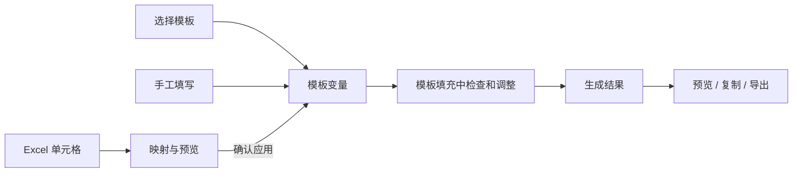

# 模板填充工具（Template Filler Tool）

[English](README.en.md) · [项目结构与开发说明](PROJECT_STRUCTURE.md) · [第三方依赖说明](THIRD_PARTY_NOTICES.md)

## 程序介绍

一个基于 Java Swing 的桌面工具，用于把手工输入或 Excel 中的数据填入文本、Word 模板，适合重复制作通知、报价单和格式固定的报告。

| 功能 | 说明 |
| --- | --- |
| 模板填充 | 支持 `.txt`、`.docx`，同名变量只需填写一次 |
| 变量与计算 | 支持数值、短字符串、多行文本、算术表达式、自动数值变量和内置日期变量 |
| Excel 数据提取 | 读取 `.xlsx`，预览单元格并建立数据到变量的映射 |
| 映射复用 | 根据表头、行标题等结构恢复映射，不按 Excel 文件名绑定 |
| 结果输出 | 生成后预览、复制文本或导出文件；Word 输出保留模板格式 |
| 本地记忆 | 保存模板变量设置、映射、界面布局和上次选取/导出的位置 |

两个选项卡共用当前模板和变量：**“数据提取”只负责预览、映射和填入数据；生成文档统一在“模板填充”中进行。**

## 快速开始

### 环境与启动

- 运行环境：Windows，Java 17 或更高版本，包含桌面图形组件；安装完整 JDK 17 或更高版本也可运行。
- 从源码构建：需要完整 JDK 17 或更高版本，以及 Windows PowerShell；无需 Maven 或 Gradle。
- 将程序放在可写目录中，便于保存模板、配置和下载依赖。依赖不完整时需要能连接 Maven Central。

已有 `TemplateTool.jar` 时，双击同目录的 `launcher.bat`，或执行：

```bat
java -jar TemplateTool.jar
```

如果只有源码，请先按下文“构建、测试与分发”生成 JAR。

### 第一次使用

1. 打开“模板填充”，选择已有模板，或点击“新建模板”创建文本模板。
2. 在模板中写入 `{{客户}}`、`{{数量}}` 等占位符，保存模板。
3. 在右侧设置变量类型、填写内容，并确认基准日期和小数位数。
4. 点击“生成结果”，检查预览后选择“复制结果”或“保存结果到文件”。

例如：

```text
客户：{{客户}}
日期：{{今日年月日}}
数量：{{数量}}，单价：{{单价}}
金额：{{=数量*单价}}
备注：{{备注}}
```

将“客户”设为短字符串、“备注”设为多行文本；“数量”和“单价”因参与表达式而固定为数值。需要从 Excel 填写时，再使用下文的数据提取流程。

## 程序如何运行

### 启动与依赖准备

1. 启动入口读取 JAR 内置的依赖清单，检查相邻 `lib/` 中的文件及 SHA-256。
2. 本地依赖完整时直接打开程序，无需联网。缺失或损坏时显示下载弹窗，展示当前文件进度与整体完成数量。
3. 全部依赖校验通过后才打开主界面。失败时可重试或取消退出；保留已完成的下载，清理未完成的文件。

构建和运行都会用到 `lib/`，但不需要手动准备。运行时也不需要在 JAR 旁另放依赖清单。

### 数据与结果流程



更换 Excel 或恢复映射只更新预览，必须点击“应用当前变量”或“应用全部变量”才会覆盖变量。修改模板、变量或日期后，旧结果会失效，需要重新生成。

加载、保存、生成和导出等文件操作在后台执行；可取消的任务会提供取消按钮。切换或刷新模板时会先处理未保存修改，加载失败或取消会保留原模板。

## 使用方法

### 模板填写与输出

- **选择模板**：使用“选择模板文件…”打开 `.txt` 或 `.docx`。模板存放在 `Templates/`，可按子文件夹分类。
- **编辑模板**：文本模板可在程序中编辑并保存；Word 模板只读，请用 Word 等外部程序编辑后点击“刷新模板”。“新建模板”创建的是 `.txt`。
- **填写变量**：同名变量只显示一次。多行文本通过“展开…”编辑；表达式引用的变量不能改成文本类型。
- **日期与精度**：基准日期每次启动默认当天，可输入 `yyyy-MM-dd` 或用日历选择。数值统一保留 0～10 位小数，默认 2 位。
- **生成与导出**：仅在“模板填充”页生成。保留 Word 格式时，请导出生成的 `.docx`；复制操作用于文本内容。

### 从 Excel 提取数据

1. 先选好目标模板和变量类型。姓名、编号、日期通常使用文本类型，参与计算的字段使用数值类型。
2. 切换到“数据提取”，点击“选择 Excel…”。上方显示 `表格.xlsx → 模板.txt/.docx`，这里选择的模板与“模板填充”同步。
3. 选择工作表，设置“列标题所在行”（如第 1 行）、“行标题所在列”（如 A 列）、全部锁定列映射的取值行和全部锁定行映射的取值列。这四项按工作表分别保存，切换工作表时自动恢复。预览顶部将列号和列标题分成两行，左侧将行号和行标题分成两列；滚动时标题区保持可见，长标题可悬停查看全文。
4. 在下方变量表点击目标变量，上方“当前变量”只显示所选名称和类型。再选择来源单元格和定位方式。默认“全部同类映射”使用来源工作表的全局取值行或列；选择“仅此映射”后才会显示该映射自己的行或列选择框，点击数据格会同步更新它。点击“添加／更新映射”。
5. 映射表显示定位方式、选定范围及完整来源，如 `客户表 / C3 / 行标题：张三 / 列标题：电话`。下方说明同步显示实际标题、来源内容、目标模板及变量、原值和预计填入值。可选择“应用当前变量”或“应用全部变量”。
6. 回到“模板填充”检查并调整，再生成和导出。

| 定位方式 | 适合的表格 | 复用方式 |
| --- | --- | --- |
| 固定单元格 | 布局稳定的报表 | 使用坐标并检查结构锚点；布局变化时需重新绑定 |
| 按行列标题 | 行列位置可能调整的同类报表 | 按标题和上下文重新定位，支持文件及工作表改名 |
| 锁定列／更改选定行 | 每行是一条客户、项目或业务记录 | 按列标题锁定栏目，选择不同数据行 |
| 锁定行／更改选定列 | 每列是一条客户、项目或业务记录 | 按行标题锁定栏目，选择不同数据列 |

“按行列标题”在创建映射时保存来源工作表、所选格的行标题和列标题，之后在结构匹配的逻辑工作表中重新寻找交叉格。工作表名称相同且结构一致时优先使用；名称变化但结构只有一个匹配时自动转到新表。“锁定”模式同样认标题；选定行必须在表头下方，选定列必须在行标题列右侧。界面切换工作表只改变查看和编辑对象，不会把其他映射改到当前表；因此应用全部变量可以同时读取多张工作表。

每张逻辑工作表分别保存标题骨架、标题行、标题列、全局取值行和全局取值列。匹配的新表整体移动时，程序按移动量换算全局位置和“仅此映射”的单独位置；新增数据行列不会改变已保存的结构锚点。多个工作表结构相同时会报告歧义，不会擅自取值。旧映射默认按“全部同类映射”读取。

“同名绑定建议…”可根据唯一同名列提出映射；锁定行模式则根据唯一同名行提出映射，由用户确认。已有映射可以更新或改为手工填写；不再存在的变量映射可用“清理失效映射”删除。未映射的变量也始终列在下方表格中。

窗口每次按 1440×1000 的默认尺寸打开，屏幕较小时自动限制在可用范围内，不记忆窗口大小。上下分隔位置会保存，下方变量表会预留显示空间；保存的位置在小窗口中超出可用范围时，仅临时限制显示位置。

### Excel 取值与映射注意事项

- **公式取值**：读取 Excel 保存的计算结果，不填入公式文本，也不重新计算公式或修改源表格。结果缺失或出错时，用 Excel 重新计算并保存，再刷新；旧缓存也可能不是最新结果。
- **文本与数值**：文本使用单元格显示内容，可保留前导零、日期格式和换行；数值使用底层值，不受显示精度影响。日期不能直接作为数字序号填入数值变量。
- **空值**：指实际来源单元格没有内容，不要求整行为空。默认“空值保留原值”；也可选择“空值取0”。目标为数值时分别保留原值或填入 0；目标为文本时，保留原文并显示提示，选择取 0 则报错并阻止本次应用。已填写的数字 0 是有效数据。找不到标题、来源错误或定位有歧义均不会被当作空值。
- **旧映射兼容**：原“当前记录／列标题”保留原有映射，显示为新名称。旧“空值报错”和“空文本清除”规则统一按“空值保留原值”读取，可逐条改为“空值取0”。
- **旧停用状态转换**：启动时检测并改写旧配置，移除启用状态字段，将停用映射转换为手工填写，保留变量原值；单独导入旧配置后读取时也会转换。新版不再提供启用／停用功能。
- **结构变化**：只有能唯一定位时才恢复映射。必要标题缺失、重复或无法区分时，需要重新绑定；固定坐标没有可识别锚点时，也需本次打开后确认绑定。
- **保存与撤销**：有效映射修改自动保存在当前模板配置中，不绑定 Excel 文件名。应用后可“撤销本次填入”，后续手工修改的冲突项会保留。来源提示 `↗` 和撤销记录只在当前模板会话内有效。
- **单条与全部应用**：“应用当前变量”只检查并填入表格中当前选中的映射，其他映射有问题时仍可使用；“应用全部变量”会先检查整批映射，任一条有问题时均不写入。空值保留原值时，单条应用提示无需修改。
- **文件更新**：Excel 在外部发生变化或不可访问时，需要刷新后再应用。刷新本身不会覆盖已填写变量。

当前支持 `.xlsx`、单行表头设置和合并标题展示；每条映射读取一个单元格。暂不支持旧 `.xls`、多层表头自动推断、区域聚合、多表关联或批量生成。超过 128 MB 或 30 万个已定义单元格时会拒绝加载，不会截断读取。

## 模板语法

### 普通变量与表达式

| 写法 | 含义 |
| --- | --- |
| `{{客户}}` | 普通变量，可选择数值或文本类型 |
| `{{1}}` | 名称为“1”的普通变量 |
| `{{=数量*单价}}` | 计算表达式 |
| `{{=金额*5%}}` | 百分比计算；`5%` 等于 `0.05` |
| `{{=[1]*[2]}}` | 引用名称为“1”“2”的变量，而非数字常量 |
| `{{=[销售 数量]*[单价-折扣]}}` | 用方括号引用含空格或特殊字符的名称 |
| `\{{客户}}` | 转义占位符，按纯文本输出 `{{客户}}`，不创建或引用变量 |

表达式支持 `+`、`-`、`*`、`/`、`**`（乘方）、`%`（后缀百分号）和括号，数字常量支持科学计数法。`{{=1*2}}` 是常量运算；内置日期变量不能参与算术运算。

短字符串和多行文本的值也可以包含占位符，并可继续嵌套多层。下级变量默认收起，点击变量名前的箭头展开；同名变量在所有层级共享类型和值。循环引用会显示完整引用路径并阻止生成，嵌套深度最多为 20 层。转义规则在主模板和所有文本变量中一致；紧邻占位符的反斜杠按奇偶解释，例如 `\{{客户}}` 输出纯文本 `{{客户}}`，`\\{{客户}}` 输出一个反斜杠后再填入“客户”。

手工填写的数值留空按 0 处理；数值与表达式结果按模板的小数位数四舍五入并补足末尾零。Excel 空值遵循映射策略，与手工留空规则不同。

### 自动数值变量

`{{上月天数}}`、`{{本月天数}}`、`{{下月天数}}`分别输出基准日期上月、本月和下月的实际天数，即 `28`、`29`、`30` 或 `31`。这些变量不显示输入框，可以直接参与运算，例如 `{{=上月天数+本月天数+下月天数}}`。

### 日期变量

日期均以界面选择的基准日期为准，而不是生成时重新读取系统日期。

| 常用写法 | 输出 |
| --- | --- |
| `{{今日年月日}}` | 完整日期，如 `2026年9月3日` |
| `{{今日年月}}`、`{{今日年}}` | 年月、年份 |
| `{{今日}}`、`{{昨日}}`、`{{明日}}` | 对应日期的日，如 `3日` |
| `{{本月}}`、`{{上月}}`、`{{下月}}` | 对应月份，如 `9月` |
| `{{本月年月}}` | 对应年月 |
| `{{本月月首}}`、`{{本月月末}}` | 当月首日/末日的月日 |
| `{{上月月首}}`、`{{上月月末}}` | 上月首日/末日的月日 |
| `{{下月月首}}`、`{{下月月末}}` | 下月首日/末日的月日 |
| `{{本年}}`、`{{上年}}`、`{{下年}}` | 对应年份 |

昨日、明日也支持“年／年月／年月日”形式，上月、本月、下月支持“年／年月”形式。月首和月末均输出 `X月X日`，跨月、跨年及闰年天数由程序自动处理。完整列表和运算示例可在 F1 帮助中查看。

旧版 `[[变量]]` 可按程序提示备份并转换为 `{{变量}}`；未转换的旧占位符不会参与填充。

## 数据保存与模板管理

下列内容由运行过程产生，不属于需要提交到仓库的项目源码：

| 位置 | 用途 |
| --- | --- |
| `Templates/` | 用户模板及模板迁移备份 |
| `Config/` | 每个模板的变量类型、当前值、小数位数和 Excel 映射 |
| `config.json` | 上次模板、界面设置、Excel 选取目录和结果导出目录 |
| `lib/` | 自动下载的运行依赖缓存 |

模板和配置使用相同的相对路径，配置名在模板完整文件名后追加 `.json`。例如：`Templates/合同/报价.docx` 对应 `Config/合同/报价.docx.json`。

- 点击程序顶部的模板名称重命名，会同步更新配置；在资源管理器中移动、复制或改名时，需自行同步对应配置，建议先关闭程序。
- 备份模板及其设置时，一起备份 `Templates/` 和 `Config/`；需要保留界面设置时再备份 `config.json`。不要把依赖缓存当成用户数据备份。
- 没有对应配置的模板会使用默认设置。不同类型的草稿只在当前会话保留，跨次运行保存当前类型和值。
- Excel 选取和结果导出分别记忆上次成功使用的目录；取消文件对话框不会修改记录。
- 如存在旧版 `last_values.json`，程序会只读迁移，原文件保留。日常使用无需手工修改配置 JSON。

主界面右上角固定的“关于”按钮提供三页离线信息：本项目许可、第三方依赖、许可原文；F1 帮助用于查看模板语法和操作说明。

## 快捷键与常见问题

| 快捷键 | 操作 |
| --- | --- |
| `Tab` | 跳到下一个变量输入框 |
| `Ctrl+Enter` | 生成结果，仅“模板填充”页有效 |
| `Ctrl+S` | “模板填充”页保存文本模板；“数据提取”页保存映射 |
| `F1` / `F4` | 打开帮助 / 循环定位输入错误 |
| `Ctrl+加号/减号` / `Ctrl+0` | 调整字号 / 跟随系统字号 |

| 问题 | 处理方式 |
| --- | --- |
| 启动提示找不到 Java，或版本不支持 | 安装 Java/JDK 17 或更高版本，检查 `JAVA_HOME` 或 PATH |
| 依赖下载失败 | 检查网络及程序目录写入权限后重试；也可复制完整 `lib/` 后重试 |
| Word 模板不能编辑 | 使用 Word 等外部程序修改，再点击“刷新模板” |
| 复制或保存结果不可用 | 检查输入错误；修改过模板、变量或日期后需重新生成 |
| Excel 映射无法恢复 | 检查工作表、列标题所在行、行标题所在列、标题唯一性和定位方式，必要时重新绑定 |
| Excel 公式结果不正确或缺失 | 在 Excel 中重新计算并保存，再刷新；程序只读取保存的结果 |
| 外部移动模板后设置丢失 | 检查对应 `Config/` 路径是否同步，再重新选择模板 |

## 构建、测试与分发

在项目根目录运行：

```bat
build.bat
```

主程序构建成功后，按需单独运行：

```bat
build-test.bat
```

| 脚本 | 职责 |
| --- | --- |
| `build.bat` | 准备依赖，递归编译主源码，打包 `TemplateTool.jar`；不运行测试 |
| `build-test.bat` | 准备依赖，针对现有 JAR 编译并运行所有回归套件；不重建或修改主程序 |
| `launcher.bat` | 使用 Java 启动已有 JAR，由 JAR 内部检查运行依赖 |

构建脚本优先使用 `JAVA_HOME`，其次查找 `Program Files/Java` 下的 JDK，最后使用 PATH。修改主源码后，应先重新构建，再测试。两个构建脚本均会自动补齐缺失或损坏的依赖，并在成功或失败退出前清理各自中间文件；强行终止进程的残留会在下次对应构建时清理。编译或打包失败会保留已有 JAR。

构建依赖版本和 SHA-256 固定在 `dependencies.lock.json`，该文件必须提交到仓库。源码、测试和文档的详细职责见 [项目结构与开发说明](PROJECT_STRUCTURE.md)。

| 分发方式 | 需要携带的内容 |
| --- | --- |
| 首次启动可联网 | `TemplateTool.jar`；按需附带 `launcher.bat` 和模板 |
| 首次启动也需离线 | 上述内容加完整的 `lib/` |

JAR 已包含依赖清单、本项目许可证、第三方说明和完整许可原文，不需要分发源码或构建脚本。需要同时交付现有变量设置和映射时，附带对应的 `Config/`。

## 项目结构

以下仅展示项目本体的维护文件和模块；模块内的具体类职责见 [项目结构与开发说明](PROJECT_STRUCTURE.md)。

```text
.
├── src/main/java/com/firefly/
│   ├── Main.java                  # 依赖就绪后的应用入口
│   ├── TemplateToolApp.java       # 主窗口与流程协调
│   ├── TemplateConstants.java     # 占位符和日期等常量
│   ├── bootstrap/                # 启动检查、依赖下载与进度窗口
│   ├── application/              # 模板会话、校验与结果生成
│   ├── core/                     # 解析、格式化、Word 处理与配置存储
│   ├── extraction/               # Excel 读取、映射与结构匹配
│   └── ui/                       # Swing 选项卡、控件与后台任务交互
├── src/main/resources/META-INF/  # 随程序打包的许可资源
│   └── THIRD_PARTY_LICENSES.txt  # 第三方许可及署名原文
├── test/java/com/firefly/
│   ├── AllTests.java              # 全部回归套件入口
│   ├── TemplateFeatureTests.java  # 模板语法、Word、配置与迁移
│   ├── application/              # 会话、生成与界面接线测试
│   ├── bootstrap/                # 依赖下载、离线启动与启动限制测试
│   └── extraction/               # Excel 读取、映射与应用测试
├── build.bat                     # 主程序构建
├── build-test.bat                # 测试构建与执行
├── launcher.bat                  # Windows 启动脚本
├── dependencies.lock.json        # 固定依赖版本、下载地址和校验值
├── .gitignore                    # 本地数据及构建产物排除规则
├── .gitattributes                # 文本与批处理换行规则
├── README.md                     # 中文使用说明
├── README.en.md                  # 英文使用说明
├── PROJECT_STRUCTURE.md          # 模块边界与开发说明
├── THIRD_PARTY_NOTICES.md         # 第三方组件及许可说明
└── LICENSE                       # 本项目许可证
```

## 许可证

本项目使用 [MIT License](LICENSE)。第三方依赖遵循各自许可证；自动下载不会免除相关许可要求，请保留依赖 JAR 内的许可证及 NOTICE，具体见 [第三方依赖说明](THIRD_PARTY_NOTICES.md)。点击主界面右上角“关于”，可离线查看本项目 MIT 许可证、第三方依赖说明和完整许可原文。
